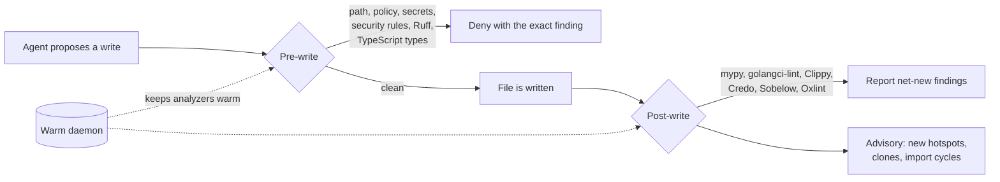

<div align="center">

# Loki

**Deterministic guardrails for AI coding agents.**

Loki checks every edit your agent makes with real analyzers and precise rules. It
blocks the dangerous ones before the file changes, tells the agent exactly what
to fix, and does all of this without calling a model.


<sub>Real hook output from <a href="https://github.com/alfredosdpiii/loki/blob/main/docs/demo/demo.sh">docs/demo/demo.sh</a>. Only the typing is simulated.</sub>

</div>

## Why Loki

- **It stops problems before they land.** Content rules, Ruff and a full
  TypeScript type check run on the proposed file before the write. XSS, leaked
  keys and broken callers never reach disk.
- **It only complains about what the edit changed.** Findings are compared
  against the committed file by rule and source line. Existing debt and shifted
  lines pass, so agents aren't blocked by code they didn't touch.
- **It uses real analyzers.** mypy, `tsc`, golangci-lint, Clippy, Credo and
  Sobelow run on every write, all net-new. Twenty-six tool-free rules cover
  what linters miss: SSRF, open redirects, request-trusted authorization, shell
  `-c` injection, ReDoS, zip slip, prototype pollution, GitHub Actions
  injection and more.
- **It's fast when it matters.** A per-repository daemon keeps the TypeScript
  checker, `dmypy` and build caches warm. A TypeScript check takes about 40 ms
  warm instead of 500 ms.
- **It measures structural sloppiness too.** `loki.py slop` scores complexity,
  duplication and import cycles in six languages and flags new hotspots as the
  agent writes them.

## How it compares

Head to head with [Interlinked CLI](https://github.com/QuentinCody/interlinked-cli)
(`82307ea`), both installed as Claude Code hooks. Each ran in a fresh sandboxed
repository per case and repetition. A defect counts only if the right diagnostic
appears on every repetition.

| Suite | Loki caught | Interlinked caught | Loki prevented before write | Loki false blocks | Interlinked false blocks |
| --- | ---: | ---: | ---: | ---: | ---: |
| **Blind holdout** (60 unseen cases, before any tuning) | **33** | 12 | **19** | 3 | 2 |
| Development corpus | **46/47** | 20/47 | **36** | **0** | 1 |
| Missing project-local JS tools | **17/17** | 13/17 | **17** | **0** | 1 |
| Holdout 1 (tuned) | **41/48** | 11/48 | **26** | **0** | 1 |
| Holdout 2 (tuned) | **42/60** | 12/60 | **29** | **0** | 2 |

Median hook latency is on par (402 ms vs 389 ms) with a much shorter tail
(p95 1.6 s vs 6.4 s). Without project-local JS tools, Loki takes 334 ms against
Interlinked's 10.8 s. Every holdout defect Interlinked catches, Loki catches too.

These are synthetic cases, not production sessions. The blind holdout was written
by an agent that could not see either product. Read the
[full results](https://github.com/alfredosdpiii/loki/blob/main/artifacts/comprehensive-summary-2026-09-26.md) and the
[benchmark protocol](https://github.com/alfredosdpiii/loki/blob/main/benchmarks/README.md).

## Quick start

Loki needs Python 3.11 or newer and has no runtime dependencies.

**1. Install the command** (once per machine):

```bash
uv tool install loki-guardrails     # or: pipx install loki-guardrails
```

**2. Set up a repository:**

```bash
cd your-repo
loki init --dir .
```

This adds a pinned copy of the engine and your policy in `.loki/`, hooks for every
supported agent (`.claude/`, `.codex/`, `.factory/`, `.pi/`, `.omp/`), starter Ruff,
Oxlint and golangci-lint configuration, and a `.github/workflows/loki.yml` CI check.
Existing configuration files are left alone.

**3. Finish the setup:**

- For JavaScript or TypeScript, install Oxlint with the command `init` prints,
  e.g. `npm i -D oxlint @oxlint/plugins`.
- Claude Code and OMP pick the hooks up automatically. In Codex, run `/hooks` and
  approve them; Pi asks you to trust the project.
- **Commit the new files yourself.** Loki reads its policy from the committed
  version, never the working tree, so an agent can't loosen the rules mid-session.
  Until you commit, `scan` reports the setup as changes awaiting review.

```bash
git add .loki .claude .codex .factory .pi .omp .ruff.toml .oxlintrc.json \
  .golangci.yml .github/workflows/loki.yml
git commit -m "Add Loki guardrails"
```

**4. Use your agent as usual.** On every edit:

- **Blocked before the write:** dangerous edits are refused with the exact finding
  (XSS, leaked keys, injection, a type error that breaks a caller, edits to Loki's
  own files), and the agent fixes them.
- **Reported after the write:** findings from mypy, `tsc`, golangci-lint, Clippy,
  Credo and Sobelow go back to the agent. Only what the edit introduced counts;
  existing debt stays quiet.
- **Advisory:** new complexity hotspots, copied code and import cycles, unless you
  make them blocking.

The first edit starts a background daemon that keeps analyzers warm.

**5. Check the whole repository whenever you like:**

```bash
loki scan                          # everything changed since the last commit
loki scan --base origin/main       # everything on your branch
loki slop                          # sloppiness score and complexity hotspots
loki slop --base main              # how this branch changed the score
```

The installed CI workflow runs `scan --strict` on every push and pull request.
Strict mode fails when an analyzer is missing instead of skipping it.

**Upgrading:**

```bash
uv tool upgrade loki-guardrails
loki init --dir . --force          # replaces the engine in .loki/; review and commit
```

Hooks always run the engine in `.loki/loki.py`, not the global `loki`, so each
repository keeps the version its policy was reviewed against until you commit an
upgrade. You can try Loki without installing it via
`uvx --from loki-guardrails loki init --dir .`, or run `python3 loki.py init` from
a clone of this repository. The
[install guide](https://github.com/alfredosdpiii/loki/blob/main/docs/reference.md#install)
covers each host in detail.

## How it works



1. **Before the write,** Loki reconstructs the file the agent is about to
   produce. It checks the path against protected policy, runs the tool-free
   content rules, and, where supported, runs Ruff and a TypeScript type check on
   the proposed content. A denial carries the precise diagnostic.
2. **After the write,** the language's analyzers run on what actually landed.
   New findings go back to the agent, while existing debt stays quiet.
3. **In CI,** `scan` repeats the checks against a base revision, including test
   integrity, dependency policy and lockfile consistency.

Loki blocks its own policy files, hook registration and CI workflow from agent
edits, so an agent can't switch it off.

## What it catches

| Language | On every write | Tool-free rules |
| --- | --- | --- |
| **Python** | Net-new Ruff and mypy (annotated code), import and AST checks | request-trusted authorization, SSRF, path traversal, shell `-c`, timing-unsafe compares, ReDoS, tautological tests |
| **TypeScript / JS** | Oxlint, project type check (pre-write), floating promises, numeric `.sort()` | XSS sinks, open redirects, `eval`, command and SQL injection, SSRF, prototype pollution, `postMessage` origin, timer leaks, ReDoS, disabled TLS |
| **Go** | gofmt, go vet, golangci-lint with gosec on changed lines | zip slip |
| **Rust** | rustfmt, net-new Clippy and compiler errors | placeholders, unchecked `get_unchecked`, unflushed `BufWriter`, shell `-c` |
| **Elixir / Phoenix** | mix format, net-new Credo and Sobelow | request-trusted authorization, SSRF, open redirects, structural `DateTime` sorts, unhandled `File` results, leaked handles |
| **Any file** | protected paths, root confinement | hardcoded credentials, merge-conflict markers, GitHub Actions script injection |

Missing analyzers are reported as `NOT CHECKED`, never as clean, and
`LOKI_STRICT=1` turns them into failures. The [reference](https://github.com/alfredosdpiii/loki/blob/main/docs/reference.md)
documents every rule, threshold and limitation.

## Structural sloppiness

`loki.py slop` puts a single number on how hard code is to change. It combines
the erosion metric from
[Measuring code sloppiness](https://earendil.com/posts/measuring-code-sloppiness/)
with [trellis](https://github.com/jayminwest/trellis)'s scoring:

```text
$ python3 .loki/loki.py slop
Sloppiness index: 26/100 (lower is better; trellis 0.2.0-provisional weights)
  complexity-erosion  26.2  eroded share 0.94, 1 of 4 functions with CC > 10
  duplication          0.0  density 0.00, 0 clone groups
  import-cycle         0.0  density 0.00, 0 cycles
hotspot src/discounts.ts:1 discount CC 17, 15 SLOC, mass 65.8
```

Complexity is exact for Python, TypeScript/JavaScript, Go and Elixir using each
language's own parser. It is approximated structurally for Rust, Java, Kotlin, C#,
C/C++, Swift, Scala, PHP and Ruby. Clones are detected on normalized tokens, so
renamed copies count. `--base` compares against a revision, and `max_index` or
`max_index_increase` can gate CI.

## Configuration

Policy lives in `.loki/loki.json` and is always read from the committed base, so
an agent can't loosen it mid-session:

```json
{
  "rule_packs": ["core", "python", "typescript", "phoenix", "shell"],
  "shell_commands": [
    {"command": "npm test", "cwd": ".", "inputs": ["package.json", "package-lock.json"]}
  ],
  "slop": {"max_index": 40, "max_index_increase": 2, "block": false},
  "elixir_security": {"sobelow": {"block": "high", "warn": "medium"}}
}
```

| Setting | Default | Effect |
| --- | --- | --- |
| `typescript_check` | on when `tsconfig.json` exists | `false` disables it; `true` makes setup problems block |
| `slop.block` | `false` | Turns new hotspots, clones and cycles from advice into failures |
| `shell_commands` | none | Exact, reviewed shell commands the shell guard admits (enable the guard with `loki init --shell-guard`) |
| `LOKI_STRICT=1` | off | Missing analyzers fail instead of reporting `NOT CHECKED` |
| `LOKI_DAEMON=0` | on | Runs every hook in-process |

## Supported agents

| Agent | Integration |
| --- | --- |
| Claude Code | `.claude/settings.json` hooks |
| Codex | `.codex/hooks.json` hooks |
| Factory Droid | `.factory/hooks.json` hooks |
| Pi | `.pi/extensions/loki.ts` |
| OMP | `.omp/extensions/loki.ts` |

## Documentation

- [Reference](https://github.com/alfredosdpiii/loki/blob/main/docs/reference.md): every check, rule, threshold and limitation
- [Benchmark protocol](https://github.com/alfredosdpiii/loki/blob/main/benchmarks/README.md) and the
  [latest results](https://github.com/alfredosdpiii/loki/blob/main/artifacts/comprehensive-summary-2026-09-26.md)
- [Blind holdout cases](https://github.com/alfredosdpiii/loki/blob/main/benchmarks/holdout2_cases.json) and the
  [runner](https://github.com/alfredosdpiii/loki/blob/main/benchmarks/holdout.py)

## Development

```bash
uv run --frozen pytest -q
bun test ./tests/loki-shim.test.ts ./tests/loki-omp.test.ts
ruff check --config templates/.ruff.toml loki.py tests benchmarks
```

Regenerate the demo with `asciinema rec -c "bash docs/demo/demo.sh" docs/demo/demo.cast`
followed by `agg docs/demo/demo.cast docs/demo/demo.gif`.
